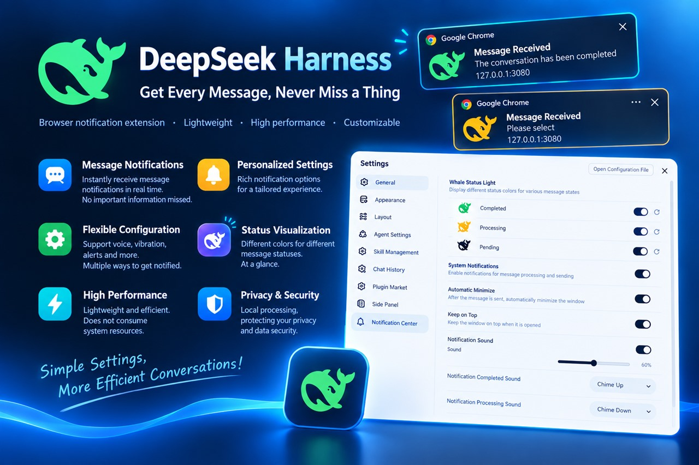
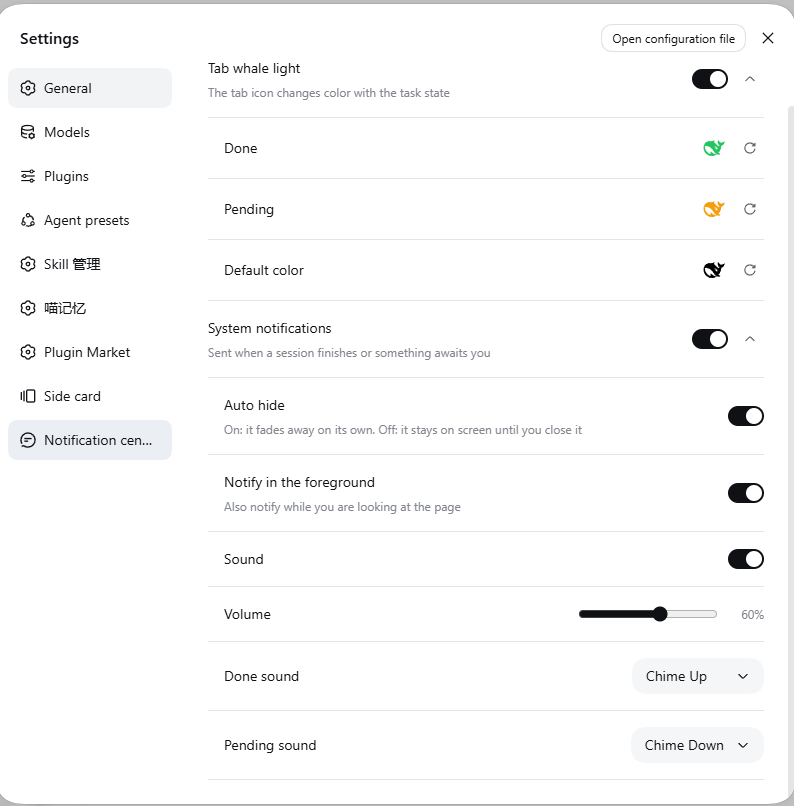

# dsh-notice-center 🔔🐋

[中文](./README.md) | **English**

[](https://github.com/SCP-QQ/dsh-notice-center/actions/workflows/test.yml)
[](https://www.npmjs.com/package/dsh-notice-center)



**In one line**: a **notification center** for DeepSeek Harness — it turns the tab's whale icon into a status light and gets your attention while you are looking elsewhere.

| | |
|---|---|
| Package | `dsh-notice-center` |
| Plugin instance id | `notice-center` |
| Settings namespace | `notice-center` |
| Install shapes | npm package / GitHub repo / tarball / local link — all four supported |

## Contents

**Usage**

- [Why you need it](#why-you-need-it)
- [Features](#features)
- [Installation](#installation)
- [Getting started in three steps](#getting-started-in-three-steps)
- [Settings reference](#settings-reference)
- [Troubleshooting](#troubleshooting)
- [Known limitations](#known-limitations)

**Development**

- [Architecture](#architecture)
- [Project layout](#project-layout)
- [Life of a notification](#life-of-a-notification)
- [Local development](#local-development)
- [Tests](#tests)
- [Releasing](#releasing)
- [Design constraints](#design-constraints)

## Why you need it

Inside Harness, the two signals that matter — "a session finished" and "something is waiting for your decision" — only show up on the **sidebar dots** and **inside the session itself**. The moment you switch to another tab or another app, they are invisible.

Long tasks make this worse: you go do something else, come back, and the session finished ages ago — or an approval request has been sitting there for ten minutes.

This plugin moves both signals somewhere you will actually see them:

| While you are away from the DSH page | What you get |
|---|---|
| A session finished | The tab whale turns **green**, plus a system notification (with the turn duration when it is a single notification) |
| Something needs you | The tab whale turns **amber**, plus a system notification (saying whether it is an approval / question / plan review) |

## Features

### 1. Whale status light

Three colours are encoded directly into the tab icon, driven by **the same official signal** as the sidebar dots, so they can never drift apart:

| Whale colour | Meaning | When it clears |
|---|---|---|
|  Green | A session **finished** while you were not watching it | Clears once you open that session; back to default once you have opened them all |
|  Amber | A session **awaits you**: question / approval / plan review | Clears once handled |
|  Black | All clear (the stock icon) | Default state |


- Only **main sessions** count; subagents do not affect it
- When both apply, **amber wins** — a pending interaction is the primary status, so a session stuck waiting on you is never masked by another session that just finished
- All three colours are configurable (including the default colour: leave it unset to keep the stock icon)

### 2. System notifications

Two events raise a notification, and by default **only while you are not looking**:

| Event | Trigger | What the notification says |
|---|---|---|
| **Finished** | A session completes | Title = session name; body = `会话已完成` (localised), with the turn duration appended when it is a single notification (e.g. `会话已完成 · 本轮总用时 2分13秒`) |
| **Pending** | A new pending interaction appears | Title = session name; body = interaction type: `待审批 · <tool>` / `请你选择` (`请你多选` for multi-select, `请你填写` when there are no options, `向你提问（N 个）` for a batch) / `计划待审核`; unknown types fall back to `有交互等待处理` |

| Finished (green) | Pending (amber) |
|---|---|
|  |  |

> Notifications are raised by the browser (Chrome here), so the card shows the browser and the site `127.0.0.1:3080` — that is expected.
> Notification bodies are localised; the examples above show the Chinese copy.

Other behaviour:

- **Click a notification** = focus the window and open that session
- **Only while you are not looking** — "foreground" means the tab is *visible* **and** the window has focus. Switching tabs, minimising, or having another app on top all notify. To also notify while you are looking (you are parked in a session but away from the screen, e.g. on your phone), turn on **Notify in the foreground**
- **Aggregation**: events within 300ms are merged into one notification, with `+N` appended to the title
- **Optional persistence**: turn off **Auto hide** and the notification stays on screen until you dismiss it
- The notification icon follows your configured status-light colours

### 3. Sounds

Finished and pending each have their own dropdown, **47 entries** in total: 2 built-in synthesised chimes plus 45 mp3s taken from opencode's bundled sound library.

| Pack | Entries |
|---|---|
| Built-in (synthesised) | `Chime Up` (finished default, rising two-tone), `Chime Down` (pending default, falling two-tone) |
| Alert | Alert 01–10 |
| Bip-bop | Bip-bop 01–10 |
| Staplebops | Staplebops 01–07 |
| Nope | Nope 01–12 |
| Yup | Yup 01–06 |

- **Hover to preview**: hovering a dropdown entry plays it (120ms debounce, so sweeping the list does not turn into noise)
- **Preview after adjusting volume**: releasing the volume slider plays the finished chime at the new volume
- With sound on, **the system notification sound is muted** and the plugin sound is used instead
- Audio is served by the host half at `/notice-center-sounds/<id>.mp3`; if that route is unavailable it **falls back to the built-in chime**, never to silence
- No migration needed: existing configs keep using `Chime Up` / `Chime Down`

## Installation

### Requirements

- **Official DeepSeek Harness** (supported range `0.1.2-rc.1+`; verified here on `0.1.5-rc.1` with client packages `0.1.5-rc.2`)
- System notifications need a **secure context** — `http://127.0.0.1:3080` or `localhost` works; over a **LAN IP** the browser's Notification API is unavailable (a browser restriction, not a plugin issue)

### Option 1: from npm (recommended)

```sh
dsh plugin --profile web add dsh-notice-center
```

Package page: <https://www.npmjs.com/package/dsh-notice-center> (`latest` is stable; prereleases go to the `next` tag — install with `dsh-notice-center@next`)

### Option 2: straight from GitHub

```sh
dsh plugin --profile web add github:SCP-QQ/dsh-notice-center
# or over SSH (when a proxy interferes with HTTPS on your machine)
dsh plugin --profile web add git+ssh://git@github.com:SCP-QQ/dsh-notice-center.git
```

### Option 3: from a tarball (offline / internal distribution)

```sh
npm pack                                        # produces dsh-notice-center-<version>.tgz
dsh plugin --profile web add ./dsh-notice-center-<version>.tgz
```

### Option 4: local link (while editing the code)

In the profile's `package.json`: add `"dsh-notice-center": "link:<project dir>"` to `dependencies` and `"dsh-notice-center"` to `dsh.profile.bundles`, then run `pnpm install` inside the profile directory.

> **All four options require a Harness restart to take effect.**
> Installing from npm / GitHub needs no extra `@deepseek-ai/*` packages from the profile — the host half's only runtime dependency is `@deepseek-ai/schemastery` (available on npm).

### Uninstall

```sh
dsh plugin --profile web remove dsh-notice-center
```

Remove the dependency and the `dsh.profile.bundles` entry, then restart — nothing is left behind.

## Getting started in three steps

1. **Open the settings page** — Settings → **Notification center** (a sidebar entry)
2. **Turn on system notifications** — flip the **System notifications** master switch; the browser asks for permission, choose *Allow*. If it was denied, the settings page tells you, and you must re-enable it in the browser's **site settings** (browsers do not ask twice)
3. **Tune as you like** — expand the two groups: change colours, pick sounds, set volume, toggle **Notify in the foreground** / **Auto hide**



After that, whenever you switch away or minimise, a finished session or a pending interaction notifies you — and clicking the notification jumps straight back to that session.

## Settings reference

| Group | Setting | Key | Default | Notes |
|---|---|---|---|---|
| Whale status light | Master switch | `colorsEnabled` | on | When off, the stock icon is kept |
| | Finished | `green` | `#22C55E` | Finished status-light colour (official sidebar colour) |
| | Pending | `amber` | `#F59E0B` | Pending status-light colour (official sidebar colour) |
| | Default colour | `black` | unset | Unset = keep the stock `/favicon.svg` |
| System notifications | Master switch | `notifyEnabled` | **off** | opt-in; turning it on asks for browser permission |
| | Auto hide | `notifyAutoHide` | on | Off = the notification stays until you dismiss it |
| | Notify in the foreground | `notifyForeground` | off | On = also notify while you are looking at the page |
| | Sound | `notifySound` | on | When on, the system sound is muted and the plugin sound plays |
| | Volume | `notifyVolume` | `0.6` | 0–1 |
| | Finished sound | `notifyDoneSound` | `builtin-up` | one of 47 |
| | Pending sound | `notifyPendingSound` | `builtin-down` | one of 47 |

Settings are persisted by Harness' settings service into the `notice-center:` section of `<DSH_HOME>/settings.yaml`.
The settings page also shows a one-line footer at the very top with the plugin name and version (e.g. "Notification center v1.3.0") — clicking it opens the repository in a new tab.

## Troubleshooting

| Symptom | Cause and fix |
|---|---|
| No "Notification center" entry in Settings | The plugin did not load. Make sure you **restarted Harness** after installing, then look for `settings namespace "notice-center" registered` in the Harness console |
| A switch does nothing / a new setting has no effect | After changing the **host half** (`lib/index.mjs`) you must restart Harness — settings writes go through the host schema |
| No notifications at all | Three conditions are required: ① the master switch is on; ② browser permission is *Allow*; ③ the page is not in the foreground when the event fires (use **Notify in the foreground** to relax this) |
| No notifications over a LAN IP | Non-secure context: the browser disables the Notification API, so system notifications are **entirely unavailable** (unrelated to *Notify in the foreground*). Use `127.0.0.1` / `localhost`; over a LAN only the tab status light works |
| Nothing after closing the tab | Known limitation, see below |
| The green light disappears after a refresh | Expected. That state is the official signal's in-memory state and is lost on refresh |
| The notification flashes by too fast | Turn **Auto hide** off and it stays until dismissed |
| No sound | Check in order: sound switch, volume not 0, whether the sound route is available (it falls back to the built-in chime, so it should never be fully silent) |
| Notifications swallowed by the OS | Windows Focus Assist / Do Not Disturb intercepts them; the plugin cannot detect it |

## Known limitations

- **No notifications once the browser tab is closed** — Web Push needs a server plus HTTPS, which is not realistic for a local plugin
- **The Notification API is unavailable in a non-secure context** (LAN IP)
- **The green state is lost on refresh** — it lives in memory only, which is the behaviour of the official signal itself
- **System-level Do Not Disturb swallows notifications** (Windows Focus Assist etc.); the plugin cannot detect it
- **The auto-hide duration is not configurable** — the Web Notification spec has no duration parameter; the desktop decides (roughly 5–20 seconds)
- **The notification card cannot be styled** — the card is rendered by the browser with no CSS or theming hook; only title, body and icon are yours

---

# Development

> Everything below is for maintainers: architecture, local development, tests and releasing. If you only want to use the plugin, you can stop here.

## Architecture

The plugin has **two halves** running in different processes, exchanging configuration through Harness' settings service:

| Part | File | Runs in | Responsibility |
|---|---|---|---|
| **Host half** | `lib/index.mjs` (128 lines) | Harness main process (Node) | ① Register the `notice-center` settings namespace schema; ② serve `/notice-center-sounds/<id>.mp3` |
| **Browser half** | `lib/client.cjs` (1344 lines) | Browser (plugin bundle) | favicon state machine + notification state machine + sound library + settings page |
| **Bundle patch** | `cordis.patch.yml` | Loader layer | Insert one row `id: notice-center` into the plugin tree |

**The host half's two optional channels**:

- `ctx.inject(["settings"], …)` — registers the schema; a success line is logged to the console as proof
- `ctx.inject(["webServer"], …)` — mounts the sound route. When the service is absent the route is not mounted and the browser half falls back to the built-in chime

**Why the host half does not import `@deepseek-ai/dsh-settings`**: since `0.1.2-rc.1` that package no longer exports `settingsNamespace()`, and `register` validates the kebab-case string itself, so passing a plain string is enough. **That keeps the host half's only runtime dependency at `@deepseek-ai/schemastery`** — and because profiles default to `autoInstallPeers: false`, resolving any `@deepseek-ai` peer would actually fail on a version mismatch and break loading. This is what makes a clean registry install possible.

**Where the browser half gets its data** (all official client services; the plugin holds no state of its own):

| Service | Provided by | Used for |
|---|---|---|
| `sessions` | `@deepseek-ai/dsh-api-session-controller/client` | Session list snapshot: `completed` / `origin` / `running` / `current` |
| `uiSession` | `@deepseek-ai/dsh-client-ui-session` | `pendingInteractions`: `Map<sessionId, { kind, … }>` |

The sound route is deliberately narrow: only `^[a-z0-9-]+\.mp3$` filenames are served (no path traversal), and because the audio is a package constant it is cached `immutable`.

## Project layout

```
package.json                    package metadata (scripts: test / test:host / test:client)
cordis.patch.yml                bundle patch layer (insert id: notice-center)
lib/index.mjs                   host half: settings schema + sound static route
lib/client.cjs                  browser half: favicon machine + notification machine + sound library + settings page
assets/audio/*.mp3              45 opencode sounds (MIT; see assets/audio/README.md)
docs/images/                    README screenshots, banners and the social-preview card
test/host-half.smoke.mjs        host-half smoke test (164 lines)
test/client-half.smoke.mjs      browser-half smoke test: state machine + real settings-page render (687 lines)
.github/workflows/test.yml      CI: runs pnpm test on push / PR
.github/workflows/publish.yml   release: tag-triggered, OIDC, no token
```

## Life of a notification

```
sessions.list changes
   └─ sync()
        ├─ trackEdges()        running true->false edge (compensation when the current session finishes)
        ├─ detectTransitions() official completed false->true; new sessions in pendingInteractions
        │     └─ queueNotification(kind, sessionId, label, typeLabel)
        │          ├─ master switch off            -> dropped
        │          ├─ this same completion already queued -> dropped (no double-send)
        │          └─ enqueued + 300ms aggregation window
        └─ targetOf() -> favicon becomes green / amber / default

300ms later, flushNotifications()
   ├─ permission not granted                     -> dropped
   ├─ page in foreground and foreground notify off -> dropped
   ├─ group by kind -> one Notification per group (title = session name, body = event type)
   └─ play the selected sound
```

Notifications deliberately carry **no `tag`**: the same session reuses the same tag across runs, and Windows/Chrome treats the later one as an *update* to an existing notification — it replaces silently and never raises a banner again.

## Local development

```sh
pnpm install          # the only runtime dependency is @deepseek-ai/schemastery
npm test              # host-half + browser-half smoke tests
```

**The restart rule has two halves — this is the easiest thing to trip over:**

| What you changed | Restart Harness? | Why |
|---|---|---|
| `lib/client.cjs` (browser half) | **No** — a page refresh is cleanest | Client HMR stat-polls the bundle and tells the browser to reload that plugin |
| `lib/index.mjs` (host half) | **Yes, mandatory** | Host-half hot reload relies on `cordis-plugin-hmr` (needs the loader to run with `--expose-internals`), which does not work in practice. **Schema changes (adding/removing settings) also need a restart** — otherwise the settings page write fails validation, which looks like "the switch does nothing" |
| First install, any rename | **Yes, mandatory** | The plugin tree and bundle list changed |

Debugging: browser-half errors land in the DevTools console; a successful host-half registration logs `dsh-notice-center: settings namespace "notice-center" registered` to the Harness console.

## Tests

```sh
npm test            # both (this is what CI runs)
npm run test:host   # host half only
npm run test:client # browser half only
```

Both smoke tests are **zero-dependency, pure Node** — no browser needed:

- **Host half** (164 lines): actually executes `apply()`, asserts only the expected services are injected, checks schema defaults and validation, exercises the sound route (serves an mp3 / 404 for unknown / rejects path traversal / all 45 packaged files present) and verifies that an existing `settings.yaml` passes the schema **with every field preserved verbatim**
- **Browser half** (687 lines): stubs `window.__ModuleLoader__` / `document` / `Notification`, evaluates the bundle and takes its factory, assembles `apply()` with a fake `ctx`, then drives state transitions and asserts the `Notification` constructor arguments. The settings page is **really rendered** against a recording stub (React element tree), asserting switch order, that each control writes only its own field, collapse behaviour, the footer, and more

Invariants pinned by the tests — do not break these:

- `PLUGIN_VERSION` / `PLUGIN_NAME` / `PLUGIN_REPO` in `lib/client.cjs` must match `package.json`
- The `SOUND_PACKS` library must map **one-to-one** onto the files in `assets/audio/`; adding a sound means updating it in **two places**: `lib/client.cjs` and `test/client-half.smoke.mjs`
- The `zh` and `en` dictionaries must have identical key sets

## Releasing

Releasing is driven by a **tag-triggered** [`publish.yml`](.github/workflows/publish.yml) — ordinary commits and pushes **never publish**:

| Intent | Command | Result |
|---|---|---|
| Commit only (feature not validated yet) | `git commit` + `git push` | Only `test.yml` runs; npm sees nothing |
| Prerelease (for testers) | set version to `1.3.0-rc.1` → commit → `git tag v1.3.0-rc.1 && git push origin v1.3.0-rc.1` | Published to the **`next`** tag; `latest` untouched |
| Stable release | set version to `1.3.0` → commit → `git tag v1.3.0 && git push origin v1.3.0` | Published to **`latest`**, with provenance attached |
| Validate the pipeline only | Actions → publish → Run workflow | Installs, tests and runs `npm pack --dry-run` — **publishes nothing** |

The workflow has **three gates**; failing any one blocks the release:

1. The tag must match the `package.json` version
2. The tagged commit must already be on `main`
3. Tests must pass

The publish step is also **idempotent**: if that version already exists on the registry it is skipped, so re-tagging or re-running never fails the build.

### One-time setup: npm Trusted Publishing (OIDC)

Publishing needs no npm token at all (so there is nothing to expire or leak). Open the package page → **Publishing Access** → *Trusted publishers* → **Add a trusted publisher** → choose **GitHub Actions**:

<https://www.npmjs.com/package/dsh-notice-center/access>

| Field | Value |
|---|---|
| Organization or user | `SCP-QQ` |
| Repository | `dsh-notice-center` |
| Workflow filename | `publish.yml` (**filename only**, no path; renaming the file requires updating this or publishing returns 403) |
| Environment name | `npm` (must match the workflow's `environment:`) |
| **Allowed actions → Allow npm publish** | ✅ **required** |

> ⚠️ That checkbox is new npm behaviour: a trusted publisher may **only `npm stage publish`** by default, so without *Allow npm publish* the workflow's `npm publish` is rejected.
> If you would rather have "staged only, human approves in the browser", leave it unchecked and change the last step to `npm stage publish`.

- With OIDC, npm attaches **provenance automatically** (no `--provenance` flag); the package page shows the attestation
- To require a manual approval after pushing a tag: repository Settings → Environments → `npm` → add **Required reviewers** (optional)
- Publishing from your own machine is still possible with a granular token: put `//registry.npmjs.org/:_authToken=<token>` in an `.npmrc` at the project root. That file is already in `.gitignore` — **never commit it**

## Design constraints

Read these before changing code — each one came from a real bug:

1. **No `tag` on notifications** — the same tag is treated as an *update* and silently replaces (see "Life of a notification")
2. **"Foreground" is `tab visible && window focused`** — using `visibilityState` alone misreads "browser buried behind another app" as "the user is looking", which is exactly when a notification matters most
3. **Amber beats green** — matching the official `sessionStatuses`; a pending interaction is the primary status
4. **The turn duration comes from observing the `running` edge** — a session already running when the page loads has no known start, so no duration is shown (never guessed)
5. **The host half keeps zero `@deepseek-ai` runtime dependencies** — only `schemastery`, otherwise a registry install breaks on peer resolution
6. **The sound route only allows `^[a-z0-9-]+\.mp3$`** — the filename goes straight into a path join, so it must be whitelisted

## Feedback and contributing

- Issues and ideas: <https://github.com/SCP-QQ/dsh-notice-center/issues>
- Run `npm test` before proposing a change; settings-related changes should update the assertions in `test/*.smoke.mjs`
- Sound assets come from [anomalyco/opencode](https://github.com/anomalyco/opencode) (MIT) — keep [`assets/audio/README.md`](./assets/audio/README.md) in sync when replacing or removing them

## License

MIT — see [`LICENSE`](./LICENSE) for the full text.

The 45 sound files in `assets/audio/*.mp3` come from [anomalyco/opencode](https://github.com/anomalyco/opencode) (`packages/ui/src/assets/audio/`), released upstream under MIT; the same licence and attribution are kept here. If upstream changes its terms, replace or remove this directory.
