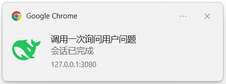
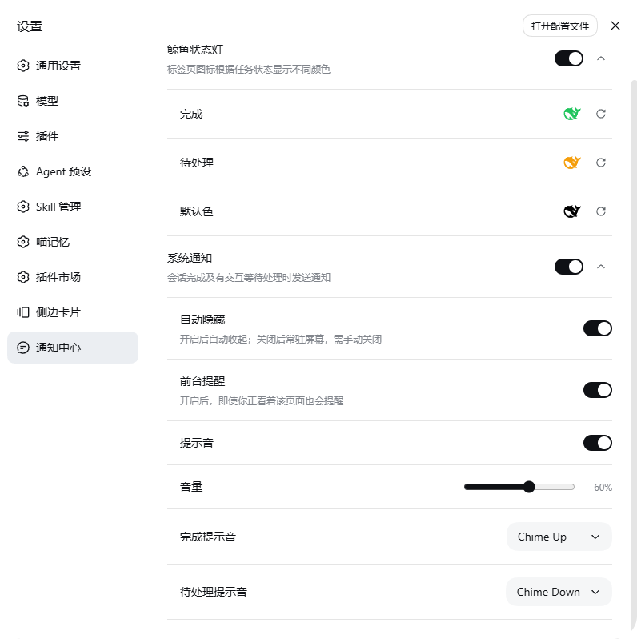

# dsh-notice-center 🔔🐋

**中文** | [English](./README.en.md)

[](https://github.com/SCP-QQ/dsh-notice-center/actions/workflows/test.yml)
[](https://www.npmjs.com/package/dsh-notice-center)


**一句话**：DeepSeek Harness 的**通知中心**——把标签页上的鲸鱼图标变成状态灯，并在你不在看的时候主动提醒你。

| | |
|---|---|
| 包名 | `dsh-notice-center` |
| 插件实例 id | `notice-center` |
| 设置命名空间 | `notice-center` |
| 安装形态 | npm 包 / GitHub 仓库 / tarball / 本地 link，四种都支持 |

## 目录

**使用**

- [为什么需要它](#为什么需要它)
- [功能特性](#功能特性)
- [安装](#安装)
- [上手三步](#上手三步)
- [设置项详解](#设置项详解)
- [常见问题](#常见问题)
- [已知限制](#已知限制)

**开发**

- [架构总览](#架构总览)
- [目录结构](#目录结构)
- [一条通知的生命周期](#一条通知的生命周期)
- [本地开发](#本地开发)
- [测试](#测试)
- [发版](#发版)
- [设计约束](#设计约束)

## 为什么需要它

在 Harness 里，「会话跑完了」和「有事等你拍板」这两个信号，只出现在**侧边栏的小圆点**和**会话本身**上。你一旦切到别的标签页、别的应用，就看不见了。

长任务尤其难受：你去干别的，回来才发现早就跑完；或者一个审批请求已经晾了十分钟。

这个插件把这两个信号搬到你能看到的地方：

| 你不在 DSH 页面时 | 你会看到 |
|---|---|
| 会话跑完了 | 标签页鲸鱼变**绿**，并弹出系统通知（单独一条时附本轮总用时） |
| 有事等你处理 | 标签页鲸鱼变**琥珀**，并弹出系统通知（写明是审批 / 提问 / 计划审核） |

## 功能特性

### 1. 鲸鱼状态灯

三种颜色直接编码在标签页图标上，和侧边栏的绿点、琥珀点**用的是同一份官方信号**，永远同步：

| 鲸鱼颜色 | 含义 | 什么时候恢复 |
|---|---|---|
|  绿色 | 有会话在你没看它的时候**跑完了** | 该会话点开后自动恢复；全部点开过一遍即回到默认状态 |
|  琥珀色 | 有会话**有事等你处理**：提问 / 审批 / 计划审核 | 处理完后自动消失 |
|  黑色 | 一切正常（官方原版图标） | 默认状态 |


- 只统计**主会话**，子代理不计入
- 绿色与琥珀同时存在时**琥珀优先**——待处理是首要状态，有会话卡住等你时，不会因为别的会话刚跑完而被掩盖
- 三种颜色都能改（含「默认色」：不配置就沿用官方原版图标）

### 2. 系统通知

两种事件会触发通知，**默认只在你不在看的时候弹**：

| 事件 | 触发时机 | 通知长什么样 |
|---|---|---|
| **完成通知** | 会话跑完 | 标题＝会话名；正文＝`会话已完成`，单独一条时附本轮总用时（如 `会话已完成 · 本轮总用时 2分13秒`） |
| **待处理通知** | 出现新的待处理交互 | 标题＝会话名；正文＝交互类型：`待审批 · <工具名>` / `请你选择`（多选则 `请你多选`、无选项则 `请你填写`、多问题则 `向你提问（N 个）`）/ `计划待审核`；认不出的类型回退为 `有交互等待处理` |

| 完成通知（绿） | 待处理通知（琥珀） |
|---|---|
|  |  |

> 通知由浏览器发出（本机是 Chrome），所以卡片上显示浏览器与站点 `127.0.0.1:3080`——这是正常的。

其余行为：

- **点击通知** = 聚焦窗口并打开对应会话
- **只在你不看的时候弹**——「前台」＝标签页可见**且**窗口有焦点；切到别的标签页、最小化、被别的应用压在后面时都会提醒。想在前台也提醒（人还停在会话里、却已离开屏幕，例如在刷手机），打开设置里的「前台提醒」
- **多条聚合**：300ms 内的事件合并为一条，标题补 `+N`
- **可常驻**：关掉「自动隐藏」后，通知会一直留在屏幕上，直到你点掉它
- 通知图标跟随你配置的状态灯颜色

### 3. 提示音

完成与待处理各有独立下拉，共 **47 个条目**：2 个插件内置合成音 + 45 个取自 opencode 内置音效库的 mp3。

| 音效包 | 条目 |
|---|---|
| 内置（合成音） | `Chime Up`（完成默认，上行双音）、`Chime Down`（待处理默认，下行双音） |
| Alert | Alert 01–10 |
| Bip-bop | Bip-bop 01–10 |
| Staplebops | Staplebops 01–07 |
| Nope | Nope 01–12 |
| Yup | Yup 01–06 |

- **悬浮即试听**：鼠标划过下拉条目就播该音效（120ms 防抖，扫过整列不会连成一片）
- **调完音量即试听**：拖动音量条松手后，会按新音量播一次完成提示音
- 开启提示音后，**系统默认提示音会被静音**，改播插件音效
- 宿主半通过 `/notice-center-sounds/<id>.mp3` 提供音频；路由不可用时**自动回退内置合成音**，不会变哑
- 老配置无需迁移：没配过音效时仍用 `Chime Up` / `Chime Down`

## 安装

### 前置要求

- **官方版本的 DeepSeek Harness**（适配范围 `0.1.2-rc.1+`；本机实测 `0.1.5-rc.1` + 客户端包 `0.1.5-rc.2`）
- 系统通知需要**安全上下文**——`http://127.0.0.1:3080` 或 `localhost` 可用；用**局域网 IP** 访问时浏览器的 Notification API 不可用（这是浏览器限制，不是插件问题）

### 方式一：从 npm 安装（推荐）

```sh
dsh plugin --profile web add dsh-notice-center
```

包页：<https://www.npmjs.com/package/dsh-notice-center>（`latest` 为稳定版，预发布版在 `next` 通道，用 `dsh-notice-center@next` 装）

### 方式二：直接从 GitHub 安装

```sh
dsh plugin --profile web add github:SCP-QQ/dsh-notice-center
# 或走 SSH（本机 HTTPS 受代理影响时）
dsh plugin --profile web add git+ssh://git@github.com/SCP-QQ/dsh-notice-center.git
```

### 方式三：从 tarball 安装（离线 / 内网分发）

```sh
npm pack                                        # 生成 dsh-notice-center-<版本>.tgz
dsh plugin --profile web add ./dsh-notice-center-<版本>.tgz
```

### 方式四：本地 link（改代码时用）

在 profile 的 `package.json` 里：`dependencies` 加 `"dsh-notice-center": "link:<项目目录>"`，`dsh.profile.bundles` 加 `"dsh-notice-center"`，然后在 profile 目录跑 `pnpm install`。

> **四种方式装完都要重启 Harness 才生效。**
> 从 npm / GitHub 安装时不需要额外提供任何 `@deepseek-ai/*` 包——宿主半的运行时依赖只有 `@deepseek-ai/schemastery`（npm 上有）。

### 卸载

```sh
dsh plugin --profile web remove dsh-notice-center
```

移除依赖与 `dsh.profile.bundles` 条目后重启，即无残留。

## 上手三步

1. **打开设置页** —— 设置 → **通知中心**（侧栏导航项）
2. **开启系统通知** —— 打开「系统通知」总开关，浏览器会弹出授权请求，选「允许」。被拒绝时设置页会提示，需要到浏览器的**站点设置**里恢复（浏览器不会二次弹窗）
3. **按需微调** —— 展开两个分组：调颜色、选音效、调音量、开关「前台提醒」/「自动隐藏」



之后你切走或最小化时，会话跑完 / 有事等你都会收到通知，点通知直接跳回那个会话。

## 设置项详解

| 分组 | 设置项 | 配置键 | 默认值 | 说明 |
|---|---|---|---|---|
| 鲸鱼状态灯 | 总开关 | `colorsEnabled` | 开 | 关闭后保持官方原版图标 |
| | 完成 | `green` | `#22C55E` | 完成状态灯颜色（官方侧边栏色） |
| | 待处理 | `amber` | `#F59E0B` | 待处理状态灯颜色（官方侧边栏色） |
| | 默认色 | `black` | 未设置 | 不设置＝沿用官方原版 `/favicon.svg` |
| 系统通知 | 总开关 | `notifyEnabled` | **关** | opt-in；开启需浏览器授权 |
| | 自动隐藏 | `notifyAutoHide` | 开 | 关＝通知常驻屏幕，需手动关闭 |
| | 前台提醒 | `notifyForeground` | 关 | 开＝你正看着页面时也提醒 |
| | 提示音 | `notifySound` | 开 | 开启后静音系统提示音，改播插件音效 |
| | 音量 | `notifyVolume` | `0.6` | 0–1 |
| | 完成提示音 | `notifyDoneSound` | `builtin-up` | 47 个可选 |
| | 待处理提示音 | `notifyPendingSound` | `builtin-down` | 47 个可选 |

配置由 Harness 的 settings 服务持久化到 `<DSH_HOME>/settings.yaml` 的 `notice-center:` 段。
设置页**最上方**还有一行页脚：插件名 + 版本号（如「通知中心 v1.3.0」），点一下在新标签页打开仓库。

## 常见问题

| 现象 | 原因与处理 |
|---|---|
| 设置里找不到「通知中心」 | 插件没加载成功。确认装完**重启过 Harness**，再看 Harness 控制台有没有 `settings namespace "notice-center" registered` 这行日志 |
| 开关点了没反应 / 加了新设置项不生效 | 改过**宿主半**（`lib/index.mjs`）后必须重启 Harness——设置写入要过宿主 schema 校验 |
| 完全不弹通知 | 三个条件缺一不可：① 系统通知总开关已打开；② 浏览器权限为「允许」；③ 触发时页面不在前台（默认策略，可用「前台提醒」放宽） |
| 用局域网 IP 打开时不弹 | 非安全上下文，浏览器禁用 Notification API，系统通知**完全不可用**（与「前台提醒」无关）。改用 `127.0.0.1` / `localhost`；局域网下只能靠标签页状态灯 |
| 标签页关掉后收不到 | 已知限制，见下文 |
| 刷新页面后绿灯变回黑色 | 正常。该状态是官方信号的内存态，刷新即丢 |
| 通知一闪而过看不到 | 关掉「自动隐藏」，通知会常驻直到你点掉它 |
| 没有声音 | 依次查：提示音开关、音量是否为 0、系统音效路由是否可用（不可用时会回退内置合成音，不会完全没声） |
| 通知被系统吞掉 | Windows「专注助手 / 勿扰」会拦截，插件无法感知 |

## 已知限制

- **浏览器标签页关闭后收不到通知**——Web Push 需要服务端 + HTTPS，本地插件场景不现实
- **非安全上下文（局域网 IP）下 Notification API 不可用**
- **刷新页面后绿色状态丢失**——该状态只存在内存中，属官方信号本身的行为
- **系统级勿扰模式会吞掉通知**（Windows 专注助手等），插件无法感知
- **自动隐藏的时长不可配**——Web Notification 规范没有时长参数，桌面端由系统决定（约 5–20 秒）
- **通知卡片的外观不可定制**——卡片由浏览器渲染，没有 CSS / 主题入口，只能控制标题、正文与图标

---

# 开发文档

> 以下是给维护者的内容：架构、本地开发、测试与发版。只想用插件的读者可以到此为止。

## 架构总览

插件由**两半**组成，各自跑在不同进程里，通过 Harness 的 settings 服务交换配置：

| 组成 | 文件 | 跑在哪 | 职责 |
|---|---|---|---|
| **宿主半** | `lib/index.mjs`（128 行） | Harness 主进程（Node） | ① 注册 `notice-center` 设置命名空间 schema；② 挂载 `/notice-center-sounds/<id>.mp3` 静态音效路由 |
| **浏览器半** | `lib/client.cjs`（1344 行） | 浏览器（插件 bundle） | favicon 状态机 + 通知状态机 + 音效库 + 设置页 |
| **bundle patch** | `cordis.patch.yml` | Loader 层 | 往插件树里插入一行 `id: notice-center` |

**宿主半的两个「可选通道」**：

- `ctx.inject(["settings"], …)` —— 注册 schema。注册成功会在控制台留一行自证日志
- `ctx.inject(["webServer"], …)` —— 挂载音效路由。服务缺席时不挂载，浏览器半自动回退到内置合成音

**为什么宿主半不 import `@deepseek-ai/dsh-settings`**：自 `0.1.2-rc.1` 起该包不再导出 `settingsNamespace()`，注册处自己按 kebab-case 校验字符串，因此直接传纯字符串即可。**这样宿主半的运行时依赖只剩 `@deepseek-ai/schemastery`**——而 profile 默认 `autoInstallPeers: false`，真去解析任何 `@deepseek-ai` peer 反而会因 npm 上的版本不匹配而加载失败。这是「能从 registry 干净安装」的关键。

**浏览器半的数据来源**（都是官方客户端服务，插件不自持状态）：

| 服务 | 提供包 | 用途 |
|---|---|---|
| `sessions` | `@deepseek-ai/dsh-api-session-controller/client` | 会话列表快照：`completed` / `origin` / `running` / `current` |
| `uiSession` | `@deepseek-ai/dsh-client-ui-session` | `pendingInteractions`：`Map<sessionId, { kind, … }>` |

音效路由的安全约束：只放行 `^[a-z0-9-]+\.mp3$` 的文件名（杜绝路径穿越），音频是随包常量故用 `immutable` 长缓存。

## 目录结构

```
package.json                    包元数据（scripts: test / test:host / test:client）
cordis.patch.yml                bundle patch 层（insert id: notice-center）
lib/index.mjs                   宿主半：settings schema + 音效静态路由
lib/client.cjs                  浏览器半：favicon 状态机 + 通知状态机 + 音效库 + 设置页
assets/audio/*.mp3              45 个 opencode 音效（MIT，来源见 assets/audio/README.md）
docs/images/                    README 截图、主图与社交预览图
test/host-half.smoke.mjs        宿主半冒烟（164 行）
test/client-half.smoke.mjs      浏览器半冒烟：状态机 + 设置页真渲染（687 行）
.github/workflows/test.yml      CI：push / PR 跑 pnpm test
.github/workflows/publish.yml   发布：打 tag 触发，OIDC 无令牌
```

## 一条通知的生命周期

```
sessions.list 变化
   └─ sync()
        ├─ trackEdges()        运行状态 true→false 边沿（当前会话在前台跑完的补偿路径）
        ├─ detectTransitions() 官方 completed false→true；pendingInteractions 新增会话
        │     └─ queueNotification(kind, sessionId, label, typeLabel)
        │          ├─ 总开关关闭 → 丢弃
        │          ├─ 同会话同类型已发过 → 丢弃（去重）
        │          └─ 入队 + 300ms 聚合窗口
        └─ targetOf() → favicon 换成 绿 / 琥珀 / 默认

300ms 后 flushNotifications()
   ├─ 权限未授权 → 丢弃
   ├─ 页面在前台且未开「前台提醒」→ 丢弃
   ├─ 按 kind 分组 → 每组一条 Notification（标题＝会话名，正文＝通知类型）
   └─ 播放所选音效
```

通知**不设置 `tag`**：同一会话反复跑完会复用同一个 tag，Windows/Chrome 会把后一条当成「更新已有通知」而静默替换、不再弹横幅。

## 本地开发

```sh
pnpm install          # 唯一运行时依赖是 @deepseek-ai/schemastery
npm test              # 宿主半 + 浏览器半冒烟
```

**重启要求分两半——这是本项目最容易踩的坑：**

| 改了什么 | 要不要重启 Harness | 为什么 |
|---|---|---|
| `lib/client.cjs`（浏览器半） | **不用**，刷新页面最干净 | 客户端 HMR 会 stat-poll 到 bundle 变化并通知浏览器重载该插件 |
| `lib/index.mjs`（宿主半） | **必须重启** | 宿主半热重载依赖 `cordis-plugin-hmr`（需 loader 带 `--expose-internals`），实测未生效。**改 schema（增删设置项）同样必须重启**——否则设置页写入过不了校验，表现为「开关点不动」 |
| 首次安装、任何改名 | **必须重启** | 插件树与 bundle 列表变了 |

调试提示：浏览器半的报错都在 DevTools Console；宿主半注册成功会在 Harness 控制台打一行 `dsh-notice-center: settings namespace "notice-center" registered`。

## 测试

```sh
npm test            # 两个都跑（CI 跑的也是这个）
npm run test:host   # 只跑宿主半
npm run test:client # 只跑浏览器半
```

两个冒烟测试都是**零依赖、纯 Node**，不需要浏览器：

- **宿主半**（164 行）：`apply()` 真执行一遍、断言只注入预期服务、schema 默认值与校验、音效路由（能取到 mp3 / 不存在 404 / 拒绝路径穿越 / 随包 45 个齐全）、settings.yaml 存量配置过 schema 且**逐项原样保留**
- **浏览器半**（687 行）：桩掉 `window.__ModuleLoader__` / `document` / `Notification`，evaluate bundle 后取 factory，用假 `ctx` 装配 `apply()`，然后驱动状态跃迁断言 Notification 的构造参数；设置页用**记录型桩**真渲染（React 元素树），断言开关顺序、只写对应字段、折叠行为、页脚等

被测试钉死的不变量（改代码时别破坏）：

- `lib/client.cjs` 里的 `PLUGIN_VERSION` / `PLUGIN_NAME` / `PLUGIN_REPO` 必须与 `package.json` 一致
- 音效库 `SOUND_PACKS` 必须与 `assets/audio/` 里的文件**一一对应**；新增音效要同步改 `lib/client.cjs` 与 `test/client-half.smoke.mjs` **两处**
- `zh` / `en` 两套文案的 key 集合必须一致

## 发版

发布由 **tag 触发**的 [`publish.yml`](.github/workflows/publish.yml) 负责——日常 commit / push **不会发包**：

| 意图 | 命令 | 结果 |
|---|---|---|
| 只提交（功能没验证完） | `git commit` + `git push` | 只跑 `test.yml`，npm 上毫无动静 |
| 预发布（给人试用） | 版本改 `1.3.0-rc.1` → commit → `git tag v1.3.0-rc.1 && git push origin v1.3.0-rc.1` | 发到 **`next`** 通道，`latest` 不变 |
| 正式发版 | 版本改 `1.3.0` → commit → `git tag v1.3.0 && git push origin v1.3.0` | 发到 **`latest`**，自动附带 provenance |
| 只验证发布流程 | Actions → publish → Run workflow | 装依赖 + 跑测试 + `npm pack --dry-run`，**不发布** |

工作流内建**三道闸**，任一不过就发不出去：

1. tag 与 `package.json` 版本必须一致
2. tag 指向的提交必须已在 `main` 上
3. 测试必须通过

另外发布步骤**幂等**：该版本已在 registry 上就跳过，重复打 tag / 重跑工作流不会红。

### 一次性配置：npm Trusted Publishing (OIDC)

发布不需要任何 npm 令牌（也就没有令牌过期 / 泄漏问题）。打开包管理页 → **Publishing Access** → *Trusted publishers* → **Add a trusted publisher** → 选 **GitHub Actions**：

<https://www.npmjs.com/package/dsh-notice-center/access>

| 字段 | 值 |
|---|---|
| Organization or user | `SCP-QQ` |
| Repository | `dsh-notice-center` |
| Workflow filename | `publish.yml`（**只填文件名**，不带路径；重命名该文件必须同步改这里，否则 403） |
| Environment name | `npm`（与工作流里的 `environment:` 一致） |
| **Allowed actions → Allow npm publish** | ✅ **必须勾** |

> ⚠️ 那个勾选框是 npm 的新行为：trusted publisher **默认只允许 `npm stage publish`（暂存）**，不勾 *Allow npm publish* 的话，工作流里的 `npm publish` 会被拒。
> 若你更想要「只能暂存、必须人工在浏览器批准才真发布」，就别勾，并把工作流末步改成 `npm stage publish`。

- 走 OIDC 发布时 npm **自动附带 provenance**（无需 `--provenance`），包页会显示来源证明
- 想要「tag 推上去还要人工点一下才发」：仓库 Settings → Environments → `npm` → 加 **Required reviewers**；不加也能正常发布
- 本机手动发布仍可用 granular token 兜底：在项目根放一个 `.npmrc` 写 `//registry.npmjs.org/:_authToken=<token>`。该文件已在 `.gitignore` 里，**绝不要提交**

## 设计约束

改代码前请先读这几条，它们都是踩过坑换来的：

1. **通知不带 `tag`**——同 tag 会被系统当成「更新已有通知」静默替换（详见上文「一条通知的生命周期」）
2. **「前台」判定是 `标签页可见 && 窗口有焦点`**——只看 `visibilityState` 会把「浏览器被别的应用压在后面」误判成正在看，而那恰恰是最该提醒的时候
3. **状态灯琥珀优先于绿**——与官方 `sessionStatuses` 一致，待处理是首要状态
4. **通知时长来自观察 `running` 边沿**——刷新页面时已经在跑的会话算不出起点，就不显示这个数（不猜）
5. **宿主半保持零 `@deepseek-ai` 运行时依赖**——只 import `schemastery`，否则 registry 安装会因 peer 解析失败而挂掉
6. **音效路由只放行 `^[a-z0-9-]+\.mp3$`**——文件名直接参与 path join，必须白名单

## 反馈与贡献

- 问题与建议：<https://github.com/SCP-QQ/dsh-notice-center/issues>
- 改动请先跑 `npm test`；涉及设置项的改动记得同步 `test/*.smoke.mjs` 的断言
- 音效素材来自 [anomalyco/opencode](https://github.com/anomalyco/opencode)（MIT），替换或移除请同步 [`assets/audio/README.md`](./assets/audio/README.md)

## License

MIT，完整许可文本见 [`LICENSE`](./LICENSE)。

音效素材（`assets/audio/*.mp3`，45 个）取自 [anomalyco/opencode](https://github.com/anomalyco/opencode) 的 `packages/ui/src/assets/audio/`，上游以 MIT 许可发布，这里保留同样的许可与署名；若上游调整授权，请同步替换或移除本目录。
